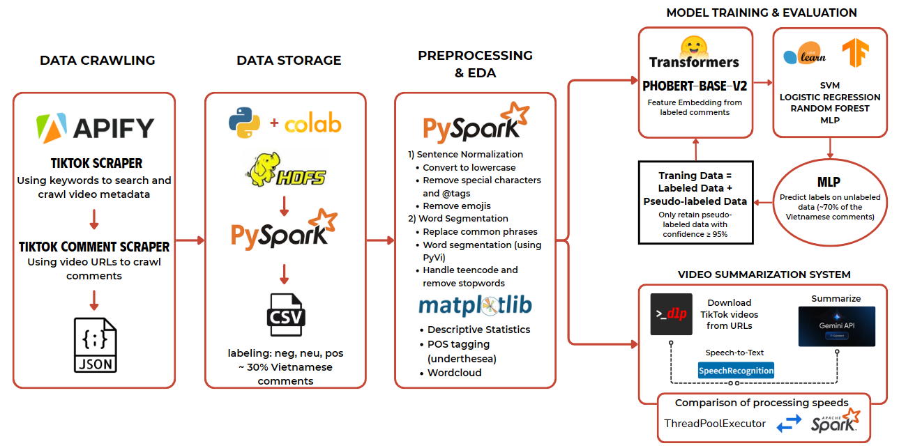

# User Opinion Analysis on Sunscreen Products on TikTok Platform

## Table of Contents
1. [Overview](#overview)
2. [Key Features](#key-features)
3. [Technology Stack](#technology-stack)
4. [Project Structure](#project-structure)
5. [How to run](#how-to-run)
6. [Project Results](#project-results)

## Overview 
This project focuses on leveraging **Big Data** and **Natural Language Processing (NLP)** technologies to analyze user opinions and behaviors regarding sunscreen products on the TikTok platform. In the rapidly evolving digital economy, TikTok has become a crucial marketing and e-commerce channel, especially for Millennials and Gen Z, who are less influenced by traditional advertising. User-generated content (UGC) on TikTok, including authentic product reviews and comments, forms a vast repository of unstructured data reflecting real consumer trends.

The main challenge lies in effectively collecting, storing, processing, and analyzing this enormous volume of unstructured data. This research aims to fill a gap in existing studies by providing a deeper analysis of specific product sentiments, particularly for highly personalized items like sunscreen, which are heavily influenced by individual experiences.

**Specific goals of this project include:**
*   Extracting insights from user-generated content to analyze user attitudes, emotions, and experiences with various sunscreen brands on TikTok.
*   Applying Big Data and NLP technologies to process and analyze video content and comments.
*   Building an adaptable model to help businesses quickly grasp user opinions, evaluate feedback, and identify consumer trends.
*   Exploring consumer trends to propose strategic directions for product development and brand communication.

The study specifically targets popular sunscreen products in the Vietnamese market, including L’Oreal Paris UV Defender, Skin Aqua Clear White, La Roche-Posay, Beplain, and Anessa.

*The overall workflow of this project*

## Key Features 
*   **Comprehensive Data Collection:** Automated scraping of TikTok video metadata and comments related to sunscreen products using **Apify**.
*   **Robust Data Processing:** Utilization of **Apache Spark** and **PySpark** for efficient processing and analysis of large, unstructured datasets.
*   **Exploratory Data Analysis (EDA):** In-depth analysis and visualization of video and comment data using **Matplotlib** and **Seaborn** to uncover market trends and consumer behavior insights.
*   **Sentiment Analysis Model:** Development of a sentiment classification model for Vietnamese comments, achieving good accuracy (over 80%) in classifying opinions as positive, negative, or neutral. This involved **PhoBERT** for feature extraction and traditional machine learning models (Logistic Regression, SVM, Random Forest) and **MLP**.
*   **Automated Video Summarization System:** A pipeline that extracts audio from TikTok video URLs, converts speech to text using **Automatic Speech Recognition (ASR)**, and generates concise summaries using the **Gemini 1.5 Flash API**. This aids in evaluating marketing content and user opinions.
*   **Distributed Storage:** Data stored on **HDFS (Hadoop Distributed File System)** for efficient management of large datasets.

## Technology Stack 
*   **Big Data Frameworks:** Apache Spark, PySpark, Hadoop Distributed File System (HDFS).
*   **Data Collection Tools:** Apify (TikTok Scraper, TikTok Comments Scraper).
*   **Natural Language Processing (NLP):**
    *   **PhoBERT**: Pre-trained language model for Vietnamese text feature extraction.
    *   **SpeechRecognition Library**: Used for Automatic Speech Recognition (ASR) to convert video audio to text.
    *   **Gemini 1.5 Flash API**: Large Language Model (LLM) for automated text summarization.
    *   **Pyvi**: Library for Vietnamese word tokenization and text cleaning.
    *   **ViTokenizer**: Specifically used for word tokenization.
*   **Machine Learning Models:** Logistic Regression, Support Vector Machine (SVM), Random Forest, Multilayer Perceptron (MLP) for sentiment classification.
*   **Data Visualization Libraries:** Matplotlib, Seaborn.
*   **Parallel Processing:** `concurrent.futures` (ThreadPoolExecutor) for multi-threading and PySpark RDDs for distributed processing.
*   **Other Libraries/Tools:** `yt-dlp` (video downloading), `ffmpeg` (audio conversion), `subprocess` (system command execution), `emoji` (emoji handling).

## Project Structure 
The repository is organized as follows:
*   `data/`:
    *   `raw/`: Contains original data scraped from TikTok via Apify.
        *   `comment_data/`: JSON files of raw comments.
        *   `video_data/`: JSON files of video metadata (e.g., views, likes, hashtags).
    *   `teencode4.txt`: List of Vietnamese slang and internet terms for text processing.
    *   `vietnamese_stopwords.txt`: List of Vietnamese stopwords for NLP.
    *   `processed/`: Processed data files.
        *   `all_comment_labeled.tsv`: Manually labeled comment data (positive, neutral, negative) for sentiment model training.
        *   `train.tsv`, `val.tsv`, `test.tsv`: Datasets split for training, validation, and testing models.
        *   `unlabeled_features.tsv`: PhoBERT extracted vector representations of unlabeled comments for pseudo-labeling.
*   `model/`: Stores trained machine learning models for sentiment classification.
    *   `LogisticRegression_best_model.pkl`: Optimized Logistic Regression model.
    *   `mlp_model.pkl`: Trained Multilayer Perceptron model.
    *   `RandomForestClassifier_best_model.pkl`: Trained Random Forest model.
*   `src/`: Contains the main source code notebooks.
    *   `Gemini_summarize.ipynb`: Jupyter notebook for video audio extraction, speech-to-text conversion, and text summarization using Gemini API.
    *   `TikTok_sentiment.ipynb`: Jupyter notebook for comment pre-processing, EDA, PhoBERT feature extraction, machine learning model training and evaluation, and pseudo-labeling.

## How to Run 
This project primarily uses **Google Colab** as the execution environment due to its free GPU support, no complex setup, and integration with Google Drive.

1.  **Environment Setup:**
    *   Ensure **Google Colab** is set up and configured.
    *   Install necessary Python libraries like `PySpark`, `transformers`, `pyvi`, `emoji`, `yt-dlp`, `ffmpeg`, `SpeechRecognition`, and other dependencies as specified in the notebooks.
    *   Set up **Hadoop HDFS (version 3.3.5)** and configure environment variables (`JAVA_HOME`, `HADOOP_HOME`, `PATH`).
2.  **Data Ingestion:**
    *   Upload your raw JSON data (`comment_data/` and `video_data/`) from Apify to the configured HDFS directories (e.g., `/user/tiktok/comments_json` and `/user/tiktok/videos_json`).
    *   Initialize a **SparkSession** within your notebooks to read data from HDFS.
3.  **Sentiment Analysis Pipeline:**
    *   Open `TikTok_sentiment.ipynb`.
    *   Follow the steps to perform data filtering (e.g., keeping Vietnamese/English videos), preliminary data cleaning, and manual labeling of a subset of comments.
    *   Execute the EDA sections to gain insights into the data distribution and user interaction patterns.
    *   Proceed with text pre-processing (normalization, tokenization, stopword removal) and feature extraction using **PhoBERT**.
    *   Train and evaluate the sentiment classification models (**Logistic Regression, SVM, Random Forest, MLP**) using the labeled dataset. The notebook also includes steps for hyperparameter optimization and pseudo-labeling.
4.  **Video Summarization Pipeline:**
    *   Open `Gemini_summarize.ipynb`.
    *   The notebook demonstrates the pipeline for downloading TikTok videos from URLs, extracting audio, converting speech to text, and summarizing the transcribed content using the **Gemini API**.
    *   It also includes a comparison of processing speed between **ThreadPoolExecutor** and **PySpark RDDs** for parallel video processing.

## Project Results 
*   **Data Collection and Analysis:** The project successfully collected a rich dataset of TikTok videos and comments related to sunscreen products. Through **Exploratory Data Analysis (EDA)**, valuable insights into market trends, consumer behavior, and user engagement with these products were highlighted and visualized. For instance, **advertising videos had significantly higher average views (2.7M vs. 484K for regular videos)** but **non-advertising videos showed a higher average engagement rate (3.64% vs. 1.57%)**, indicating a preference for authentic, personal content over direct advertisements. Common hashtags like `#kemchongnang` and product-specific terms like `da_dầu` (oily skin) were frequently observed, reflecting key consumer concerns.
*   **Sentiment Analysis:** A sentiment classification model was developed and trained using manually labeled comments. The model achieved a **good accuracy of 84% with PhoBERT + Logistic Regression**. The distribution of sentiment labels showed that **neutral comments constituted the largest portion (46.3%)**, suggesting users often provide descriptive or objective feedback. Pseudo-labeling was applied to expand the training dataset, demonstrating the value of semi-supervised learning, though its overall performance improvement was limited to certain models like Random Forest.
*   **Video Content Summarization:** An automated pipeline was successfully developed, capable of extracting content from TikTok video URLs, converting speech to text, and generating concise summaries using the **Gemini API**. Performance comparisons for this pipeline revealed that **ThreadPoolExecutor (with 5 threads) was significantly faster than Spark (with 2 partitions) for video processing tasks**. This pipeline effectively condenses video content, supporting further analysis of user opinions and marketing effectiveness.

---
---

## Team Members
> *   **Nguyễn Mai Hồng Trâm** (Team Leader)
> *   **Đỗ Ngọc Phương Anh**
> *   **Nguyễn Ngọc Thúy Anh**
> *   **Huỳnh Minh Phương**
> *   **Trần Vọng Triển**

## Acknowledgement
We would like to sincerely thank Dr. Nguyễn Mạnh Tuấn for his dedicated instruction and valuable feedback throughout the Big Data and Applications course. We also appreciate the constructive comments and suggestions from other student groups in the Big Data and Applications course (UEH Semester 1, 2025), which helped us identify mistakes and find appropriate ways to improve our project.